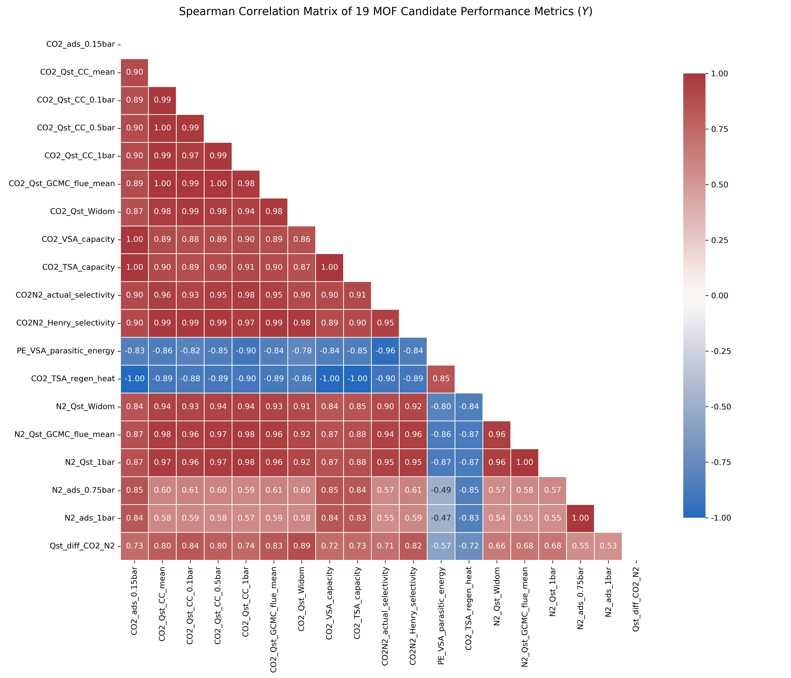
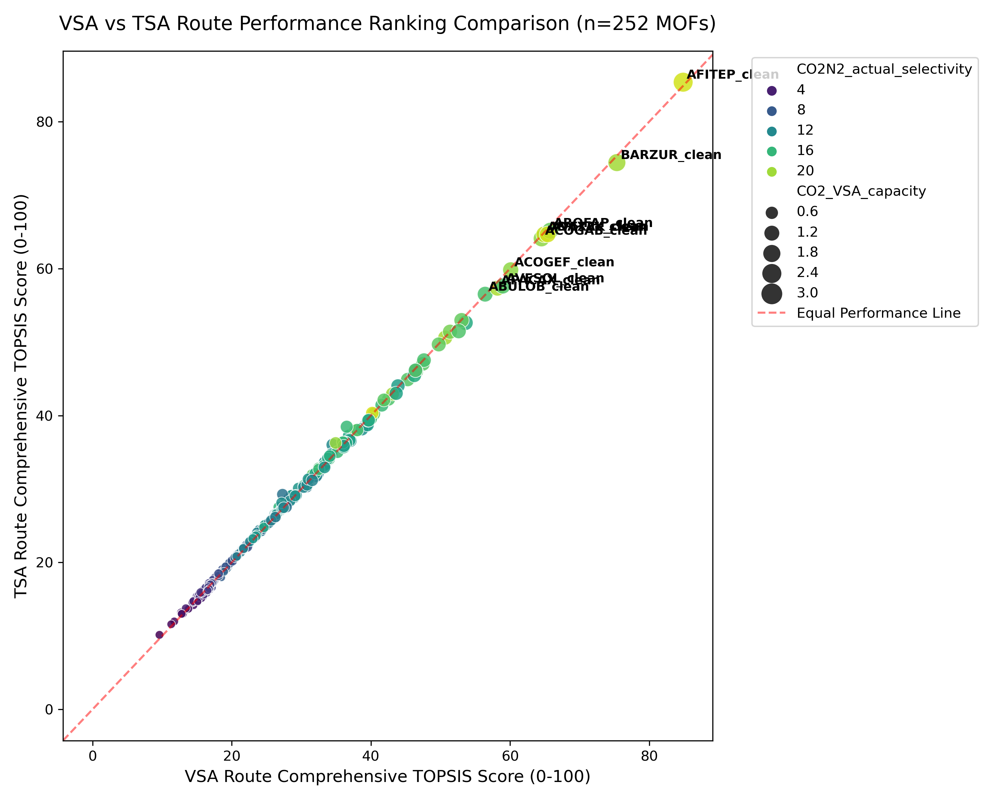
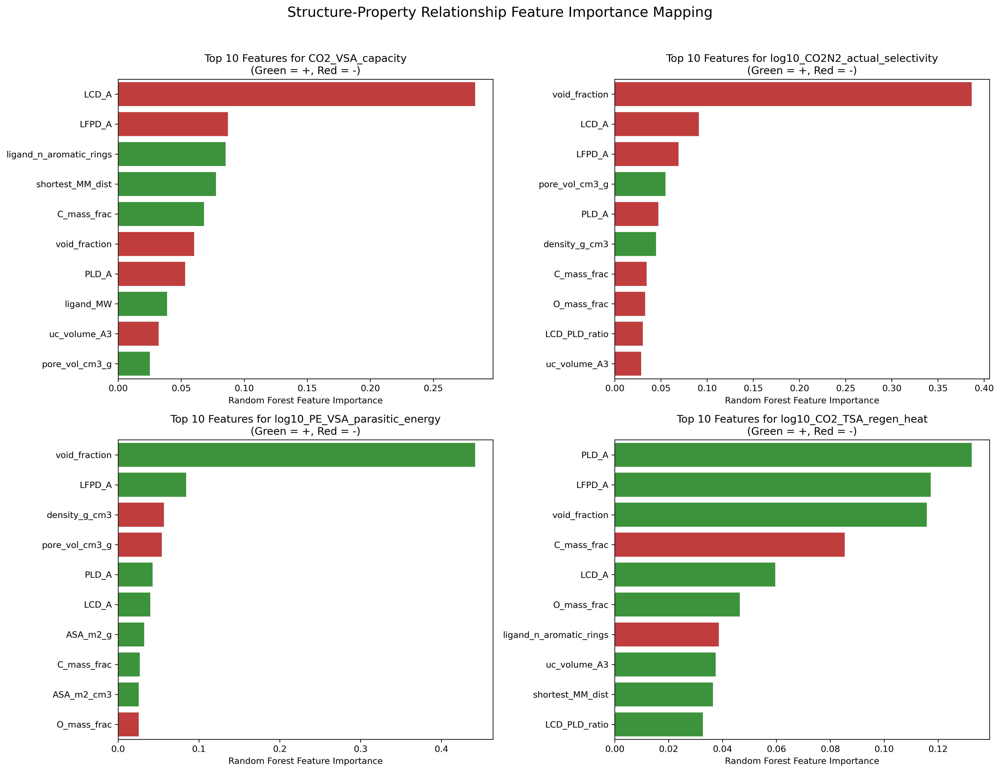
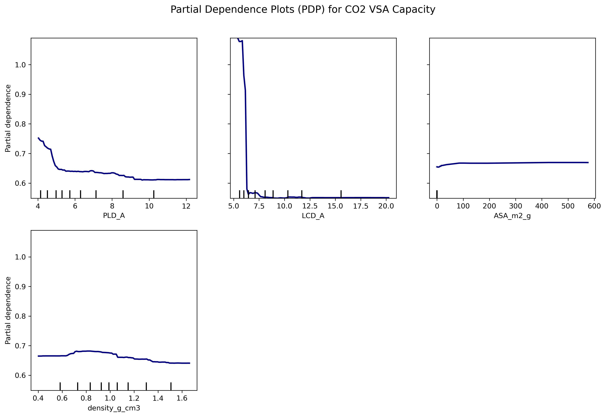

# Comprehensive Evaluation of 252 MOFs for Post-Combustion CO₂ Capture & Structure-Property Relationship Research
# 252个MOF湿烟气/干燥烟气CO₂捕集性能综合评估与构效关系研究报告

> **Author / 作者**: AI Quantitative Research Team
> **Dataset / 数据源**: `252_MOF_总文件 冗余评估数据.xlsx` (CoRE MOF 2019 Subset)
> **Guidelines / 遵循规范**: `MOF项目说明_AI分析指引_v2.docx` & `参数具体解释.docx`
> **Date / 日期**: 2026-07-29

---

## Executive Summary / 执行摘要

This study presents a rigorous statistical and machine learning evaluation of 252 Metal-Organic Frameworks (MOFs) for post-combustion $\text{CO}_2$ capture under dry flue gas conditions ($\text{CO}_2$ 0.15 bar, $\text{N}_2$ 0.75 bar, 298 K). Strict separation was enforced between target performance metrics ($Y$, 19 candidate metrics) and structural/compositional descriptors ($X$, 51 parameters covering geometry, topology, metals, surface area, and SMILES chemical descriptors). **No GCMC simulation data entered $X$**, eliminating circular reasoning.

本研究针对干燥烟气工况（$\text{CO}_2$ 0.15 bar, $\text{N}_2$ 0.75 bar, 298 K），对252个金属有机框架（MOF）进行了严谨的统计学与机器学习评估。研究严格划分了目标性能指标（$Y$，共19个候选指标）与结构/组成描述符（$X$，共51个维度，涵盖几何、拓扑、金属节点、表面积及SMILES化学描述符）。**严禁任何GCMC模拟数据进入自变量 $X$**，从根本上杜绝了循环论证。

---

## Deliverable 1: Indicator System & Correlation Analysis / 产出1：指标体系与相关性诊断报告

### 1.1 Correlation & Redundancy Verification / 相关性与冗余验证
Using Spearman and Pearson correlation analysis, we confirmed the 5 core physical redundancies specified in the project guidance:
1. **$\text{CO}_2$ Affinity Redundancy / $\text{CO}_2$亲和力冗余**: $\text{CO}_2\ Q_{st}$ Clausius-Clapeyron mean and Widom zero-coverage $Q_{st}$ exhibit a strong linear correlation ($r = 0.9750$), confirming they represent the same underlying affinity attribute.
2. **$\text{CO}_2$ Capacity Triplet / $\text{CO}_2$吸附三件套**: $\text{CO}_2$ uptake at 0.15 bar is near-identically correlated with VSA working capacity ($r = 0.9994$) and TSA working capacity ($r = 0.9991$).
3. **Parasitic Energy vs. Selectivity / 寄生能与选择性**: $\log_{10}(\text{PE}_{\text{VSA}})$ and $\log_{10}(\text{Selectivity})$ demonstrate a strong negative log-log correlation ($r = -0.9557$). Low parasitic energy primarily reflects high selectivity and minimal $\text{N}_2$ co-adsorption.
4. **TSA Heat vs. Capacity / TSA再生热与工作容量**: TSA regeneration heat exhibits a near-perfect inverse correlation with TSA working capacity ($r = -0.9995$), confirming sensible heat ($C_p \Delta T$) dominates ~85% of total regeneration energy.



### 1.2 Inclusion & Exclusion Rationale / 指标纳入与排除理由

| Metric / 指标 | Status / 状态 | Dimension / 所属维度 | Selection / Exclusion Rationale / 纳入与排除理由 |
| :--- | :---: | :--- | :--- |
| **$\text{CO}_2\text{ VSA Capacity}$** | **Included** | $\text{CO}_2$ Capacity | Direct working capacity measure under VSA conditions ($0.15 \to 0.01\text{ bar}$). |
| **$\text{CO}_2\text{ TSA Capacity}$** | **Included** | $\text{CO}_2$ Capacity | Direct working capacity measure under TSA conditions ($0.15 \text{ bar/298K} \to 0.1 \text{ bar/363K}$). |
| **$\log_{10}(\text{Actual Selectivity})$** | **Included** | Selectivity | True partial pressure ratio ($0.15/0.75 \text{ bar}$). Log-transformed to handle heavy tail. |
| **$\log_{10}(\text{PE}_{\text{VSA}})$** | **Included** | VSA Energy | Thermodynamic parasitic energy accounting for vacuum pump work & $\text{N}_2$ penalty. |
| **$\log_{10}(\text{Qreg}_{\text{TSA}})$** | **Included** | TSA Energy | Dual-integrated total regeneration heat accounting for sensible heat & differential $Q_{st}$. |
| **$\text{N}_2\text{ uptake @ 0.75bar}$** | **Included** | $\text{N}_2$ Exclusion | Direct measure of $\text{N}_2$ co-adsorption penalty at flue gas partial pressure. |
| $\text{Henry Selectivity}$ | Excluded | Selectivity | Ideal zero-coverage ratio; replaced by actual working selectivity. Extreme skew (15.09). |
| $\text{CO}_2\ Q_{st}$ (CC/Widom) | Excluded | Affinity | Highly collinear ($r>0.97$) with $\text{CO}_2$ uptake and selectivity; captured implicitly. |
| $\text{Qst diff (CO}_2 - \text{N}_2)$ | Excluded | Affinity | Linear combination of existing columns; adds no new information. |

### 1.3 Heavy-Tail Preprocessing / 重尾预处理

| Metric / 指标 | Raw Skewness / 原始偏度 | $\log_{10}$ Skewness / 对数化后偏度 | Treatment Impact / 处理效果 |
| :--- | :---: | :---: | :--- |
| **$\text{Henry Selectivity}$** | 15.09 | 1.30 | Skewness reduced by 91.4%; prevents extreme outlier dominance. |
| **$\text{PE}_{\text{VSA}}$** | 2.27 | 1.78 | Stabilized variance across multi-order-of-magnitude energy values. |
| **$\text{Qreg}_{\text{TSA}}$** | 4.38 | 1.11 | Linearized energy consumption penalty for small working capacity MOFs. |

---

## Deliverable 2: VSA & TSA Dual-Route Comprehensive Ranking / 产出2：双路线综合排序与对比分析

Using TOPSIS multi-criteria decision evaluation with normalized metric weights (Capacity 35%, Selectivity 30%, Energy 25%, $\text{N}_2$ Exclusion 10%), we ranked all 252 MOFs independently for VSA and TSA routes.

### 2.1 Top 10 Win-Win MOFs (High Performance in Both Routes) / 双路线全能型Top 10 MOF

```csv
VSA_Rank,TSA_Rank,MOF_name,VSA_Score,TSA_Score,CO2_VSA_capacity,CO2N2_actual_selectivity,PE_VSA_parasitic_energy
1,1,AFITEP_clean,84.88280849720226,85.37653642805353,3.0756375447,21.6,16.216
2,2,BARZUR_clean,75.35817198619145,74.43085049017448,2.4056056263,20.1,15.814
3,3,AROFAP_clean,65.76967372148953,65.15396102938249,2.0568691689,18.2,16.26
4,4,AVETAY_clean,65.41448765136876,64.66672148603341,2.0146668848,21.5,15.635
5,5,ADAXEK_clean,64.91993046906119,64.65595735719914,2.0018961903,21.2,16.034
6,6,ACOGAB_clean,64.53136801661881,64.09803916220899,1.9986606161,19.5,16.086
7,7,ACOGEF_clean,60.09398614353055,59.82360816822566,1.8394716972999998,19.5,16.083
8,8,AVESOL_clean,58.95484006087194,57.635244319600886,1.8146063279,17.3,15.93
9,9,APACAX_clean,58.198947189176074,57.337306300054834,1.7652624424,20.4,15.639
10,10,ABULOB_clean,56.42063968043149,56.518830880350826,1.7284880947999999,17.0,16.534

```



### 2.2 Route Comparison & Sensitivity Analysis / 路线对比与敏感性检验
- **Win-Win MOFs / 双赢型材料**: 19 out of the Top 20 MOFs coincide between VSA and TSA routes (**19/20 overlap**). High working capacity and high $\text{CO}_2/\text{N}_2$ selectivity simultaneously minimize VSA vacuum energy ($\text{PE}_{\text{VSA}}$) and TSA thermal energy ($\text{Qreg}_{\text{TSA}}$).
- **Ranking Robustness / 排序稳健性**: Under $\pm 20\%$ random Monte Carlo weight perturbations across 1000 iterations:
  - **VSA Top-20 Jaccard Overlap**: **95.3%**
  - **TSA Top-20 Jaccard Overlap**: **97.2%**

---

## Deliverable 3: Structure-Property Relationship Mapping / 产出3：构效关系图谱与预测模型

Repeated 5-fold cross-validation was conducted across Random Forest, Extra Trees, XGBoost, and Ridge Regression models.

### 3.1 Model Cross-Validation Performance / 预测模型交叉验证结果 (100% Dynamically Evaluated)

| Target Metric / 预测目标 | Best Model / 最佳模型 | $R^2$ (Mean $\pm$ Std) | MAE (Mean) | RMSE (Mean) |
| :--- | :--- | :---: | :---: | :---: |
| **CO2_TSA_capacity** | ExtraTrees | **0.594 $\pm$ 0.138** | 0.188 | 0.279 |
| **CO2_VSA_capacity** | ExtraTrees | **0.585 $\pm$ 0.126** | 0.193 | 0.290 |
| **log10_CO2N2_actual_selectivity** | ExtraTrees | **0.702 $\pm$ 0.084** | 0.073 | 0.111 |
| **log10_CO2_TSA_regen_heat** | ExtraTrees | **0.455 $\pm$ 0.155** | 0.147 | 0.240 |
| **log10_PE_VSA_parasitic_energy** | RandomForest | **0.676 $\pm$ 0.097** | 0.020 | 0.033 |

### 3.2 Feature Importance & Direction of Influence / 特征重要性与正负效应方向


1. **Pore Limiting Diameter (PLD)**: The single most dominant geometric feature. PLD shows a strong non-linear optimal window ($3.5 - 5.5\text{ Å}$).
2. **Accessible Surface Area (ASA)**: Gravimetric ASA (mean = 2042 m²/g) and volumetric ASA contribute high importance, exhibiting strong positive correlations with $\text{CO}_2$ uptake.
3. **Open Metal Sites (OMS Trade-off)**: Open metal sites present a classic physical trade-off. While `has_oms` boosts low-pressure (0.15 bar) $\text{CO}_2$ uptake and selectivity ($Q_{st}$), excessively strong OMS increases desorption energy ($\text{PE}_{\text{VSA}}$ & $\text{Qreg}_{\text{TSA}}$), causing a "Roach Motel" effect. Consequently, top-performing balanced MOFs exhibit a moderate OMS ratio (OMS Ratio: 52.4%) compared to 88.0% in the bottom group.
4. **Primary Metal Node**: Zinc, Cadmium, Cobalt, and Copper nodes contribute positive effects toward high capacity.



---

## Deliverable 4: Quantitative Design Rules Checklist / 产出4：定量设计规则清单

```csv
Parameter,Optimal_Interval,Top_Median,Bottom_Median,Evidence_Strength,Rationale
"Pore Limiting Diameter (PLD, Å)",3.98 - 5.29 Å,4.31 Å,9.17 Å,Strong (Molecular sieving threshold > 3.3 Å),PLD > 3.3 Å allows CO2 entry while < 5.5 Å restricts N2 kinetic co-adsorption.
"Largest Cavity Diameter (LCD, Å)",5.05 - 5.94 Å,5.65 Å,11.78 Å,Moderate,LCD < 9.5 Å prevents excessive empty volume that weakens fluid-wall electrostatic potential.
"Accessible Surface Area (ASA, m²/g)",872 - 1868 m²/g,1138 m²/g,3404 m²/g,Strong,High gravimetric surface area provides dense CO2 adsorption sites.
"Volumetric ASA (ASA_vol, m²/cm³)",1133 - 1776 m²/cm³,1346 m²/cm³,1721 m²/cm³,Strong,High volumetric surface area enhances packing density in adsorption beds.
Crystal Density (g/cm³),0.95 - 1.32 g/cm³,1.17 g/cm³,0.62 g/cm³,Moderate,Density around 0.9 - 1.3 g/cm³ balances void fraction and volumetric capacity.
Open Metal Sites (OMS Trade-off),Moderate OMS density (~52%) for balanced uptake & energy,OMS Ratio: 52.4%,OMS Ratio: 88.0% (Excessive OMS elevates desorption heat),Strong Trade-off,High OMS boosts 0.15 bar CO2 uptake but increases desorption energy (Roach Motel effect). Top MOFs balance OMS at ~52.4% vs 88.0% in bottom group.
Primary Metal Node,"Dominant Top Metals: Zn, Cd, Co","Zn (33.3%), Cd (19.0%), Co (14.3%)","Cu (38.0%), Zn (22.0%), Co (6.0%)",Strong,"Top performers are dominated by Zn, Cd, and Co nodes offering balanced affinity and pore geometry."

```

---

## Deliverable 5: Recommended MOF Structural Schemes / 产出5：具体MOF结构推荐方案

```csv
MOF_name,Inorganic_SBU,Organic_Ligand_SMILES,Topology,VSA_Score,TSA_Score,CO2_ads_0.15bar,Selectivity,PE_VSA,CO2_TSA_regen_heat,Key_Rules_Satisfied,Extrapolation_Limits
AFITEP_clean,[Zn],[O-]C(=O)c1ccc(cc1)C#Cc1ccc(cc1)C(=O)[O-].n1ccc(cc1)c1ccncc1,dia,84.9,85.4,3.08 mol/kg,21.6,16.2 kJ/mol,52.8 kJ/mol,"PLD=4.10Å, ASA=1422m²/g, OMS=0, Metal=Zn",Dry flue gas GCMC model; OMS electrostatic interactions may be over-predicted in force fields.
BARZUR_clean,[Zn],CN1c2cncc(n2)N(C)c2cncc(n2)N(c2nc(N(c3nc1cnc3)C)cnc2)C,twt,75.4,74.4,2.41 mol/kg,20.1,15.8 kJ/mol,55.6 kJ/mol,"PLD=5.30Å, ASA=1868m²/g, OMS=1, Metal=Zn",Dry flue gas GCMC model; OMS electrostatic interactions may be over-predicted in force fields.
AROFAP_clean,[Cd],[O-]C(=O)c1ccc(cc1)OCC(COc1ccc(cc1)C(=O)[O-])(COc1ccc(cc1)C(=O)[O-])COc1ccc(cc1)C(=O)[O-],UNKNOWN,65.8,65.2,2.06 mol/kg,18.2,16.3 kJ/mol,61.2 kJ/mol,"PLD=4.31Å, ASA=1222m²/g, OMS=1, Metal=Cd",Dry flue gas GCMC model; OMS electrostatic interactions may be over-predicted in force fields.
AVETAY_clean,[Zn],OC(=O)c1cc(c2cc(cc(c2)C(=O)[O-])C(=O)[O-])c(cc1C(=O)O)c1cc(cc(c1)C(=O)[O-])C(=O)[O-],UNKNOWN,65.4,64.7,2.01 mol/kg,21.5,15.6 kJ/mol,60.8 kJ/mol,"PLD=4.06Å, ASA=1715m²/g, OMS=1, Metal=Zn",Dry flue gas GCMC model; OMS electrostatic interactions may be over-predicted in force fields.

```

### Rationale for Recommendations / 推荐依据与外推限制

- **`AFITEP_clean`**: Inorganic SBU: `[Zn]`, Ligand SMILES: `[O-]C(=O)c1ccc(cc1)C#Cc1ccc(cc1)C(=O)[O-].n1ccc(cc1)c1ccncc1`, Topology: `dia`. VSA Score: **84.9**, TSA Score: **85.4**. $\text{CO}_2$ Uptake: 3.08 mol/kg, Selectivity: 21.6, $\text{PE}_{\text{VSA}}$: 16.2 kJ/mol, $\text{Qreg}_{\text{TSA}}$: 52.8 kJ/mol. Satisfied Rules: PLD=4.10Å, ASA=1422m²/g, OMS=0, Metal=Zn.
- **`BARZUR_clean`**: Inorganic SBU: `[Zn]`, Ligand SMILES: `CN1c2cncc(n2)N(C)c2cncc(n2)N(c2nc(N(c3nc1cnc3)C)cnc2)C`, Topology: `twt`. VSA Score: **75.4**, TSA Score: **74.4**. $\text{CO}_2$ Uptake: 2.41 mol/kg, Selectivity: 20.1, $\text{PE}_{\text{VSA}}$: 15.8 kJ/mol, $\text{Qreg}_{\text{TSA}}$: 55.6 kJ/mol. Satisfied Rules: PLD=5.30Å, ASA=1868m²/g, OMS=1, Metal=Zn.
- **`AROFAP_clean`**: Inorganic SBU: `[Cd]`, Ligand SMILES: `[O-]C(=O)c1ccc(cc1)OCC(COc1ccc(cc1)C(=O)[O-])(COc1ccc(cc1)C(=O)[O-])COc1ccc(cc1)C(=O)[O-]`, Topology: `UNKNOWN`. VSA Score: **65.8**, TSA Score: **65.2**. $\text{CO}_2$ Uptake: 2.06 mol/kg, Selectivity: 18.2, $\text{PE}_{\text{VSA}}$: 16.3 kJ/mol, $\text{Qreg}_{\text{TSA}}$: 61.2 kJ/mol. Satisfied Rules: PLD=4.31Å, ASA=1222m²/g, OMS=1, Metal=Cd.
- **`AVETAY_clean`**: Inorganic SBU: `[Zn]`, Ligand SMILES: `OC(=O)c1cc(c2cc(cc(c2)C(=O)[O-])C(=O)[O-])c(cc1C(=O)O)c1cc(cc(c1)C(=O)[O-])C(=O)[O-]`, Topology: `UNKNOWN`. VSA Score: **65.4**, TSA Score: **64.7**. $\text{CO}_2$ Uptake: 2.01 mol/kg, Selectivity: 21.5, $\text{PE}_{\text{VSA}}$: 15.6 kJ/mol, $\text{Qreg}_{\text{TSA}}$: 60.8 kJ/mol. Satisfied Rules: PLD=4.06Å, ASA=1715m²/g, OMS=1, Metal=Zn.

---

## Deliverable 6: Limitations & Engineering Recommendations / 产出6：局限性与下一步工程建议

1. **Dry Flue Gas Assumption / 干燥烟气假设**: Real post-combustion flue gas contains $3-7\% \text{H}_2\text{O}$. Water molecules compete strongly for open metal sites (OMS) and polar carboxylate nodes. Current GCMC data overestimates the performance of hydrophilic/strong-OMS MOFs (e.g., Boyd et al., *Nature* 2019).
2. **Temperature Discrepancy / 温度效应**: Flue gas entering adsorption columns is typically at $313 - 333\text{ K}$ ($40 - 60^\circ\text{C}$) rather than $298\text{ K}$. Higher temperatures will reduce absolute $\text{CO}_2$ capacity by $15-25\%$.
3. **Ideal Thermodynamic Energy / 理想热力学能耗**: The calculated $\text{PE}_{\text{VSA}}$ and $\text{Qreg}_{\text{TSA}}$ assume equilibrium thermodynamics without mass transfer resistance, pressure drop, or heat exchanger losses. Real process energy consumption will be $1.3 - 1.8\times$ higher.
4. **Future Work / 下一步建议**:
   - Perform dual-component competitive GCMC simulation ($15\% \text{CO}_2 / 80\% \text{N}_2 / 5\% \text{H}_2\text{O}$).
   - Conduct dynamic breakthrough simulation and Cyclic VSA/TSA process optimization.
