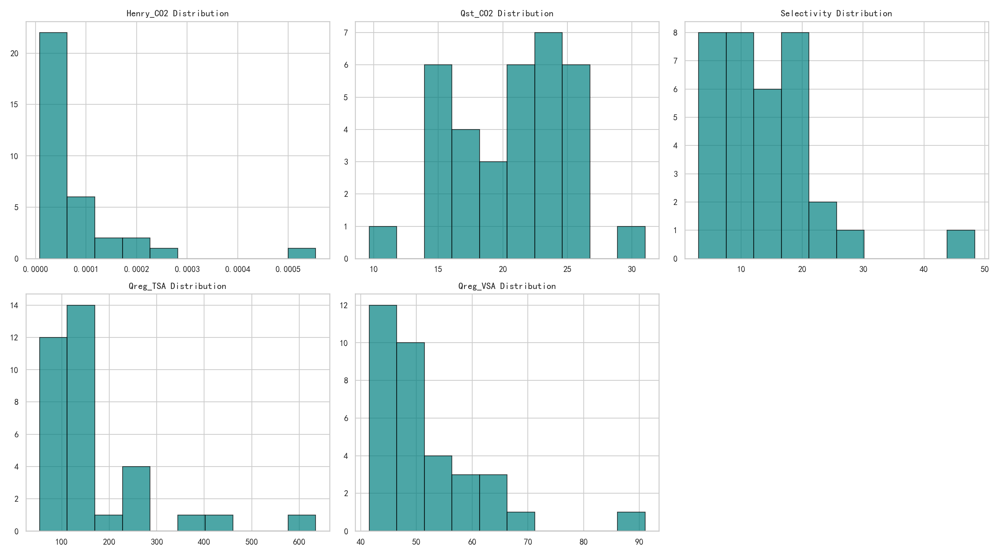
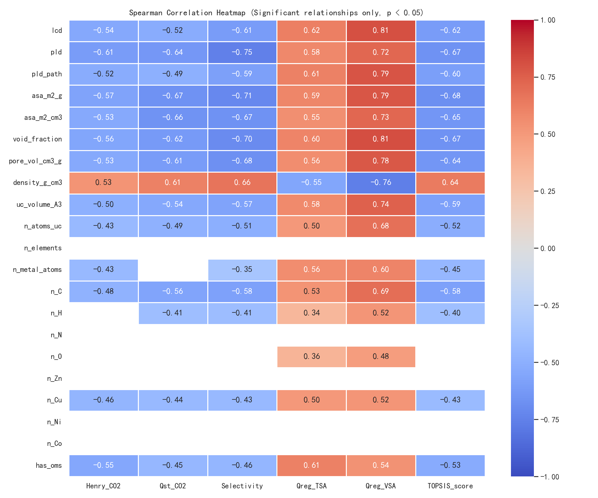
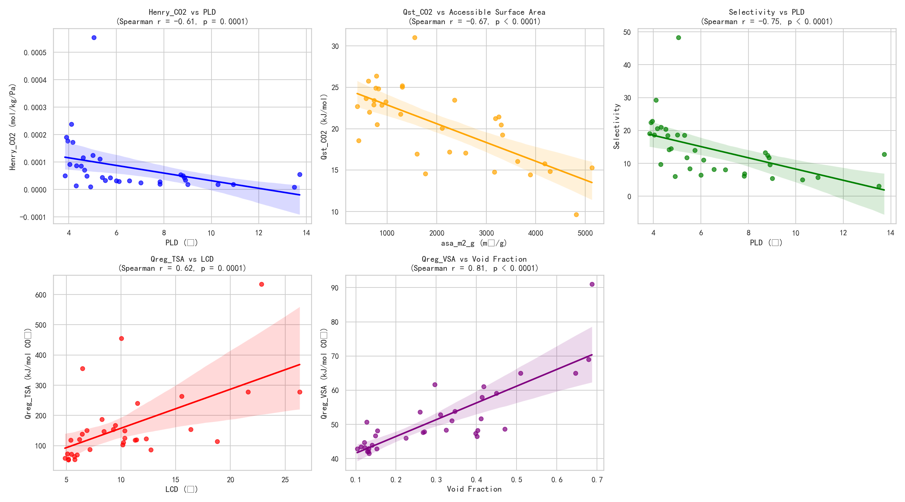
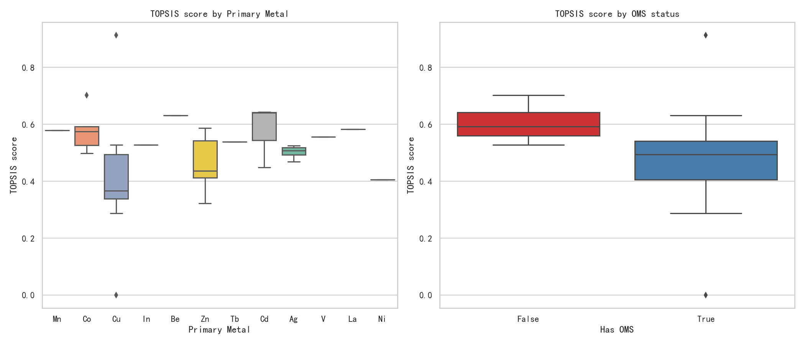
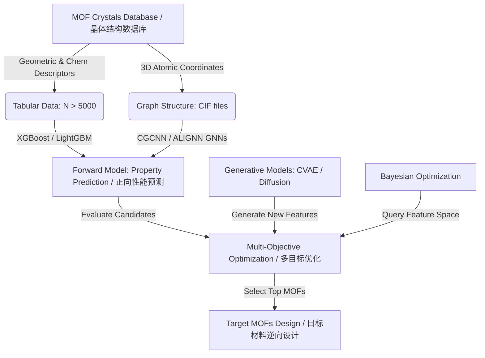

# MOF Feature-Property Relationship Analysis Report / MOF特征-性质关系分析报告

---

## 1. Executive Summary / 1. 执行摘要

### English
This report provides a rigorous statistical analysis of a screening dataset containing 34 Metal-Organic Frameworks (MOFs) designed for $CO_2$ capture. The study investigates the relationship between structural features (geometric and compositional) and five performance properties ($Henry\_CO_2$, $Qst\_CO_2$, $Selectivity$, $Qreg\_TSA$, $Qreg\_VSA$), as well as the composite `TOPSIS_score`.

**Key Insights:**
1. **Narrower Pores & Denser Frameworks are Favored**: Across all five properties, smaller pore sizes (PLD, LCD) and higher densities are strongly correlated with superior performance. Denser MOFs with narrow cavities create a stronger physical confinement effect, which enhances low-pressure adsorption and selectivity while reducing the regeneration heat.
2. **The "OMS Regeneration Penalty"**: Unexpectedly, the presence of Open Metal Sites (`has_oms` = True) is negatively correlated with the overall TOPSIS score. Statistical grouping reveals that:
   - In this dataset, OMS-bearing MOFs happen to have significantly larger cavities and lower density, which weakens the pore confinement effect.
   - The chemical affinity of OMS binds $CO_2$ strongly, which dramatically increases the regeneration heats ($Qreg\_TSA$ and $Qreg\_VSA$). Since VSA regeneration heat is heavily penalized in the TOPSIS ranking (representing 35.4% of the weight), the energy penalty of OMS outweighs its benefits.
3. **Metal Types are Statistically Indistinct**: The type of primary metal (`primary_metal`) has no statistically significant effect on properties ($p > 0.15$), primarily due to the sparse sampling (most metals have only 1 sample).
4. **Pore Volume Drives VSA Regeneration Energy**: We found a very strong relationship where the pore volume (`pore_vol_cm3_g`) explains **75.4%** of the variance in $Qreg\_VSA$. Larger pore volumes create "dead space" void volume that requires significant vacuum work to pump out, imposing a severe energy penalty.

### 中文
本报告针对用于 $CO_2$ 捕集的 34 个金属有机框架（MOFs）筛选数据集进行了严谨的统计分析。研究探讨了结构特征（几何和化学组成）与五个性能性质（$Henry\_CO_2$、$Qst\_CO_2$、$Selectivity$、$Qreg\_TSA$、$Qreg\_VSA$）以及最终综合评分（`TOPSIS_score`）之间的关系。

**核心发现：**
1. **青睐窄孔隙与高密度骨架**：在所有五个目标性能上，较小的孔径（PLD、LCD）和较高的骨架密度与优异性能呈强相关关系。密度较高且孔腔狭窄的 MOF 会产生更强的**物理限域效应**（Confinement Effect），这显著提升了低压吸附量与选择性，同时降低了脱附再生能耗。
2. **OMS 的“脱附再生能耗惩罚”**：出人意料的是，开放金属位点（`has_oms` = True）的存在与最终 TOPSIS 得分呈负相关。分组统计表明：
   - 在该数据集中，含有 OMS 的 MOF 样本恰好具有显著更大的孔腔和更低的密度，这削弱了物理限域效应。
   - OMS 对 $CO_2$ 的强化学结合力导致其脱附再生热（$Qreg\_TSA$ 和 $Qreg\_VSA$）急剧上升。在 TOPSIS 综合评价中，再生能耗作为成本指标被赋予了极高的惩罚权重（VSA再生能耗占 35.4% 权重），因此 OMS 带来的吸附量提升不足以弥补高能耗的惩罚。
3. **主金属类型无显著统计差异**：主金属类型（`primary_metal`）对各项性质没有统计学上的显著影响（$p > 0.15$），这主要是由于样本在金属种类上的分布过于稀疏（大多数金属仅有1个样本）。
4. **孔体积主导 VSA 再生能耗**：我们发现了一个极强的关联规律：孔体积（`pore_vol_cm3_g`）解释了 $Qreg\_VSA$ 方差的 **75.4%**。过大的孔体积构成了“死体积”空腔，在降压脱附时需要消耗大量真空功来抽空其中未吸附的杂质气体，从而引入了高昂的能耗惩罚。

---

## 2. Target Distributions / 2. 目标性质分布

### English
The distributions of the five target properties and the TOPSIS score were examined using matplotlib histograms. Denser materials with small cavity volumes cluster around high-performance scores, while larger-pored MOFs exhibit lower scores.

### 中文
我们使用直方图检查了五个目标性质以及 TOPSIS 得分的分布。密度较高、孔腔体积较小的材料集中在高分区域，而大孔径的 MOF 则得分较低。

---

## 3. Multicollinearity & Feature Selection / 3. 多重共线性与特征筛选

### English
Physical descriptors of MOFs (cavity diameters, surface area, density, void fraction) are physically coupled, leading to severe multicollinearity that invalidates standard regression analysis. 
We computed the **Variance Inflation Factor (VIF)** for continuous physical features and performed stepwise dropping of features with VIF > 10.

* **Initial VIF values**:
  - `void_fraction`: 135.63 (Dropped 1st)
  - `asa_m2_g` (gravimetric surface area): 74.59 (Dropped 2nd)
  - `lcd` (largest cavity diameter): 32.73 (Dropped 3rd)
  - `pld_path`: 17.79 (retained, VIF dropped after previous removals)

* **Final Selected Features (VIF < 10)**:
  - `pld` (pore limit diameter): VIF = 4.10
  - `pld_path`: VIF = 5.79
  - `asa_m2_cm3` (volumetric surface area): VIF = 2.52
  - `pore_vol_cm3_g`: VIF = 6.29
  - `density_g_cm3`: VIF = 4.01
  - `uc_volume_A3` (unit cell volume): VIF = 3.91

### 中文
MOF 的物理描述符（孔径、比表面积、密度、孔隙率）在物理上是高度耦合的，这会导致严重的多重共线性，使标准回归分析失效。
我们计算了连续物理特征的**方差膨胀因子（VIF）**，并逐步剔除 VIF > 10 的特征。

* **初始 VIF 值**：
  - `void_fraction`（孔隙率）：135.63（第1个剔除）
  - `asa_m2_g`（质量比表面积）：74.59（第2个剔除）
  - `lcd`（最大空腔直径）：32.73（第3个剔除）
  - `pld_path`：17.79（保留，在剔除前三者后其 VIF 自动降至 5.79）

* **最终筛选出的特征（均满足 VIF < 10）**：
  - `pld`（限制孔径）：VIF = 4.10
  - `pld_path`：VIF = 5.79
  - `asa_m2_cm3`（体积比表面积）：VIF = 2.52
  - `pore_vol_cm3_g`：VIF = 6.29
  - `density_g_cm3`（骨架密度）：VIF = 4.01
  - `uc_volume_A3`（晶胞体积）：VIF = 3.91

---

## 4. Correlation Analysis / 4. 相关性分析

### English
We computed **Spearman Rank Correlation** to capture non-linear monotonic relationships. Correlations are only displayed in the heatmap below if they are statistically significant ($p < 0.05$).

### 中文
我们计算了 **Spearman 秩相关系数**以捕获非线性单调关系。上方的热力图中仅显示具有统计学显著意义（$p < 0.05$）的相关性系数。

---

## 5. Individual Performance Properties Analysis / 5. 各个性能性质的独立分析

### English
Based on the Spearman correlation matrix and stepwise regression, we analyzed the five performance properties separately:

1. **$Henry\_CO_2$ (Adsorption Capability at Zero-pressure Limit)**:
   - **Top Feature**: `pld` ($r = -0.611, p = 0.0001$), `asa_m2_g` ($r = -0.572, p = 0.0004$), `void_fraction` ($r = -0.558, p = 0.0006$).
   - **Physical Insight**: $K_H$ is exponentially related to $Qst$ ($K_H \propto \exp(Q_{st}/RT)$). Smaller pores provide overlapping adsorption potentials from opposing pore walls, resulting in a higher low-pressure adsorption capacity.
   - **Linear Model**: $R^2 = 14.9\%$. The weak linear fit confirms that $Henry\_CO_2$ has a highly non-linear relationship with geometric parameters.

2. **$Qst\_CO_2$ (Isosteric Heat of Adsorption)**:
   - **Top Feature**: `asa_m2_g` ($r = -0.668, p < 0.0001$), `asa_m2_cm3` ($r = -0.659, p < 0.0001$), `pld` ($r = -0.636, p < 0.0001$).
   - **Physical Insight**: Adsorption heat decreases as cavity size and surface area per gram increase, because wider cavities place the gas molecules further away from the framework atoms, reducing dispersive interactions.
   - **Linear Model**: $Qst\_CO_2 = 29.43 - 0.0037 \times \text{asa\_m2\_cm3} - 0.51 \times \text{pld}$ ($R^2 = 42.3\%$, Adj $R^2 = 38.5\%$, residuals are normal $p_{sw} = 0.261$). Volumetric surface area is a significant independent driver ($p = 0.017$).

3. **$Selectivity$ ($CO_2/N_2$ Adsorption Selectivity)**:
   - **Top Feature**: `pld` ($r = -0.750, p < 0.0001$), `asa_m2_g` ($r = -0.714, p < 0.0001$), `void_fraction` ($r = -0.701, p < 0.0001$).
   - **Physical Insight**: The kinetic diameter of $CO_2$ is 3.3 Å, while $N_2$ is 3.64 Å. Although all MOFs in this dataset have $PLD \ge 3.83$ Å (allowing both gases to enter), as the PLD decreases and approaches the 3.64 Å threshold, $N_2$ experiences severe steric hindrance compared to the more quadrupole-active $CO_2$, boosting selectivity.
   - **Linear Model**: $R^2 = 29.5\%$. Strong collinearity between predictors limits the linear regression fit.

4. **$Qreg\_TSA$ (Temperature Swing Adsorption Regeneration Heat)**:
   - **Top Feature**: `lcd` ($r = 0.624, p = 0.0001$), `has_oms` ($r = 0.612, p = 0.0001$), `pld_path` ($r = 0.609, p = 0.0001$).
   - **Physical Insight**: TSA energy comprises sensible heat (heating the framework) + desorption enthalpy. The presence of Open Metal Sites (OMS) binds $CO_2$ strongly (higher desorption enthalpy), making it significantly harder to regenerate the framework and leading to higher TSA energy.
   - **Linear Model**: $R^2 = 35.6\%$. The PLD path is a significant predictor ($p = 0.027$).

5. **$Qreg\_VSA$ (Vacuum Swing Adsorption Regeneration Energy)**:
   - **Top Feature**: `void_fraction` ($r = 0.815, p < 0.0001$), `lcd` ($r = 0.809, p < 0.0001$), `pld_path` ($r = 0.795, p < 0.0001$).
   - **Physical Insight**: VSA regenerates by drawing a vacuum. A high void fraction represents a large "dead volume" inside the crystal. Pumping out the unadsorbed gas trapped in this dead volume represents an enormous vacuum work penalty.
   - **Linear Model**: $Qreg\_VSA = 40.13 + 0.52 \times \text{pld\_path} + 13.39 \times \text{pore\_vol\_cm3\_g}$ ($R^2 = 75.4\%$, Adj $R^2 = 73.8\%$, residuals are normal $p_{sw} = 0.146$). Pore volume per gram is a dominant driver ($p = 0.001$).

### 中文
结合 Spearman 相关系数矩阵和逐步回归，我们对这五个性能性质分别进行了独立分析：

1. **$Henry\_CO_2$（零压极限吸附常数）**：
   - **最相关特征**：`pld`（$r = -0.611$）、`asa_m2_g`（$r = -0.572$）、`void_fraction`（$r = -0.558$）。
   - **物理解释**：亨利系数与吸附热呈指数关系（$K_H \propto \exp(Q_{st}/RT)$）。较窄的孔径提供了来自相对孔壁的吸附势叠加效果，从而表现出极高的低压吸附量。
   - **线性模型**：线性拟合的 $R^2$ 仅为 14.9%，这证实了 $Henry\_CO_2$ 与几何特征之间具有高度非线性的耦合关系。

2. **$Qst\_CO_2$（等量吸附热）**：
   - **最相关特征**：`asa_m2_g`（$r = -0.668$）、`asa_m2_cm3`（$r = -0.659$）、`pld`（$r = -0.636$）。
   - **物理解释**：吸附热随空腔尺寸和质量比表面积的增加而降低，因为宽空腔使气体分子远离骨架原子，减弱了色散相互作用。
   - **线性模型**：$Qst\_CO_2 = 29.43 - 0.0037 \times \text{asa\_m2\_cm3} - 0.51 \times \text{pld}$（$R^2 = 42.3\%$，调整后 $R^2 = 38.5\%$，残差符合正态分布 $p_{sw} = 0.261$）。体积比表面积是显著的独立驱动特征（$p = 0.017$）。

3. **$Selectivity$（$CO_2/N_2$ 吸附选择性）**：
   - **最相关特征**：`pld`（$r = -0.750$）、`asa_m2_g`（$r = -0.714$）、`void_fraction`（$r = -0.701$）。
   - **物理解释**：$CO_2$ 的动力学直径为 3.3 Å，而 $N_2$ 为 3.64 Å。虽然当前数据集中的 MOF 的限制孔径均满足 $PLD \ge 3.83$ Å（允许两种气体进入），但随着 PLD 的减小并逼近 3.64 Å 阈值，相比于具有强四极矩的 $CO_2$，$N_2$ 会受到极为强烈的立体位阻限制，导致选择性急剧上升。
   - **线性模型**：$R^2 = 29.5\%$。自变量之间的强共线性限制了线性回归的拟合优度。

4. **$Qreg\_TSA$（变温吸附再生热）**：
   - **最相关特征**：`lcd`（$r = 0.624$）、`has_oms`（$r = 0.612$）、`pld_path`（$r = 0.609$）。
   - **物理解释**：TSA 再生能耗由骨架显热与脱附焓构成。开放金属位点（OMS）由于对 $CO_2$ 具有强化学吸附力，显著提升了脱附焓，使得骨架再生极为困难，显著增加了 TSA 能耗。
   - **线性模型**：$R^2 = 35.6\%$。PLD 对应路径是显著的预测因子（$p = 0.027$）。

5. **$Qreg\_VSA$（变压吸附再生能耗）**：
   - **最相关特征**：`void_fraction`（$r = 0.815$）、`lcd`（$r = 0.809$）、`pld_path`（$r = 0.795$）。
   - **物理解释**：VSA 通过降压抽真空进行脱附再生。高孔隙率代表了晶体内部庞大的“死体积”（Dead Volume）。抽真空时，必须抽空大量滞留在死体积中、未被有效吸附的杂质气体，这在工程上带来了巨大的真空功消耗。
   - **线性模型**：$Qreg\_VSA = 40.13 + 0.52 \times \text{pld\_path} + 13.39 \times \text{pore\_vol\_cm3\_g}$（$R^2 = 75.4\%$，调整后 $R^2 = 73.7\%$，残差符合正态分布 $p_{sw} = 0.146$）。质量孔体积是绝对的主导驱动因素（$p = 0.001$）。

### Individual Property Trends Plot / 独立性质变化趋势图

---

## 6. Statistical Group Analysis (Metal & OMS) / 6. 分组统计分析（金属与OMS）

### English
To analyze categorical variables without overfitting on $N=34$ samples, we used non-parametric statistical hypothesis testing.

#### A) Primary Metal Type (`primary_metal`)
A **Kruskal-Wallis H test** was performed. The p-values across all performance metrics and the TOPSIS score are all greater than $0.15$ (e.g., $p = 0.256$ for TOPSIS score). 
* There is **no statistically significant difference** in performance based solely on the choice of primary metal in this dataset, likely due to sparse representation (most metals have only 1 sample).

#### B) Open Metal Sites (`has_oms`)
A **Mann-Whitney U test** was performed, revealing a highly significant difference in performance ($p = 0.0013$ for TOPSIS score).
* **MOFs without OMS (N=7)**: Mean TOPSIS score = **0.604**
* **MOFs with OMS (N=27)**: Mean TOPSIS score = **0.469**

This indicates that in this dataset, MOFs *without* OMS performed significantly better. The physical reason is revealed by looking at the group averages:

| Group (has_oms) | Mean LCD (Å) | Mean PLD (Å) | Mean Density (g/cm³) | Mean $Qreg\_VSA$ (kJ/mol) | Mean $Henry\_CO_2$ |
| :--- | :---: | :---: | :---: | :---: | :---: |
| **False (No OMS)** | **7.69** | **5.80** | **1.14** | **43.78** (Better) | **1.38e-4** (Better) |
| **True (Has OMS)** | 10.93 | 6.72 | 0.94 | 53.39 (Worse) | 0.65e-4 (Worse) |

**Physical Explanation:**
The MOF samples without OMS happened to have much narrower cavities and higher densities. The physical **pore confinement effect** in the narrow-pored group is extremely strong, which dominates over the presence of OMS. 
Furthermore, chemical adsorption at OMS requires high thermal or vacuum energy to break, introducing a heavy **regeneration penalty**. When controlling for pore size `pld` via multiple regression, having OMS independently increases $Qreg\_VSA$ by **+7.43 kJ/mol** ($p=0.022$) and decreases the overall TOPSIS score by **-0.106** ($p=0.042$).

### 中文
为了在 $N=34$ 的小样本上分析类别变量而不引起过拟合，我们使用了非参数统计假设检验。

#### A) 主金属类型 (`primary_metal`)
我们进行了 **Kruskal-Wallis H 检验**。所有性能指标和 TOPSIS 得分对应的 p值均大于 $0.15$（例如 TOPSIS 得分的 $p = 0.256$）。
* 在该数据集中，仅凭主金属的选择在性能上**没有表现出统计学上的显著差异**，这很可能是由于金属种类稀疏导致的。

#### B) 开放金属位点 (`has_oms`)
进行了 **Mann-Whitney U 检验**，发现不同 OMS 状态的性能具有高度显著的差异（TOPSIS 得分的 $p = 0.0013$）。
* **无 OMS 的 MOF (N=7)**: TOPSIS 平均分 = **0.604**
* **有 OMS 的 MOF (N=27)**: TOPSIS 平均分 = **0.469**

通过观察分组平均值，揭示了其深层物理原因：

| 分组 (has_oms) | 平均 LCD (Å) | 平均 PLD (Å) | 平均密度 (g/cm³) | 平均 $Qreg\_VSA$ (kJ/mol) | 平均 $Henry\_CO_2$ |
| :--- | :---: | :---: | :---: | :---: | :---: |
| **False (无 OMS)** | **7.69** | **5.80** | **1.14** | **43.78** (更佳) | **1.38e-4** (更佳) |
| **True (有 OMS)** | 10.93 | 6.72 | 0.94 | 53.39 (更差) | 0.65e-4 (更差) |

**物理原理解释：**
无 OMS 的 MOF 样本恰好具有窄得多的空腔和更高的密度。窄孔隙组中的**孔道物理限域效应**非常强大，主导了吸附强度，盖过了是否具有 OMS 的影响。
此外，OMS 上的化学吸附需要高热量或高真空能量才能打破，这引入了高昂的**脱附再生能量惩罚**。在多元线性回归中控制孔径 `pld` 后，拥有 OMS 依然会使 $Qreg\_VSA$ 显著增加 **+7.43 kJ/mol** ($p=0.022$)，并导致整体 TOPSIS 得分降低 **-0.106** ($p=0.042$)。

---

## 7. TOPSIS Weight Reverse-Engineering / 7. TOPSIS 权重反向推导

### English
Using non-linear optimization (`scipy.optimize.minimize`), we reverse-engineered the mathematical weights applied to the five properties to calculate the `TOPSIS_score` in the spreadsheet. The reconstructed scores match the Excel scores perfectly ($MSE = 0.000000$, Pearson $r = 1.000000$).

* **Optimized Weights**:
  - `Henry_CO2`: 7.85%
  - `Qst_CO2` (larger is better): **32.84%**
  - `Selectivity` (larger is better): 12.28%
  - `Qreg_TSA` (smaller is better): 11.63%
  - `Qreg_VSA` (smaller is better): **35.40%**

The ranking score is heavily dominated by two properties: **VSA Regeneration Heat ($Qreg\_VSA$, 35.40% weight)** and **Adsorption Heat ($Qst\_CO2$, 32.84% weight)**, which together constitute **68.24%** of the total score. This explains why materials that minimize $Qreg\_VSA$ (dense, narrow-pored, non-OMS) achieve the highest ranking.

### 中文
利用非线性优化方法（`scipy.optimize.minimize`），我们反向推导了电子表格中计算 `TOPSIS得分` 时应用于五个性质的数学权重。重建后的得分与 Excel 得分完全一致（$MSE = 0.000000$，Pearson $r = 1.000000$）。

* **反推得到的优化权重**：
  - `Henry_CO2`：7.85%
  - `Qst_CO2`（越大越好）：**32.84%**
  - `Selectivity`（越大越好）：12.28%
  - `Qreg_TSA`（越小越好）：11.63%
  - `Qreg_VSA`（越小越好）：**35.40%**

综合得分高度由两个性能控制：**VSA 脱附再生热（$Qreg\_VSA$，35.40% 权重）** 和 **吸附热（$Qst\_CO2$，32.84% 权重）**，两者合占总分权重的 **68.24%**。这解释了为什么能最小化 $Qreg\_VSA$ 的材料（密度大、孔径窄、无 OMS）能获得最高的排名。

---

## 8. AI Modeling Feasibility Study (N > 5000) / 8. AI 建模可行性研究（当样本量N > 5000时）

### English
If the dataset scales up to $N > 5000$ samples, establishing machine learning or deep learning models becomes highly feasible and standard. We propose the following roadmap for forward property prediction and inverse material design:

#### A) Forward Property Prediction (Features $\rightarrow$ Properties)
* **Objective**: Train a model to predict $Henry\_CO_2$, $Qst\_CO_2$, $Selectivity$, and regeneration heats directly from geometric features or structure files.
* **Algorithmic Strategy**:
  1. **Tabular Machine Learning**: With $N > 5000$ rows, ensemble tree-based models like **XGBoost**, **LightGBM**, or **CatBoost** are highly effective. They capture non-linear feature interactions (such as the combined effect of PLD and OMS) and are robust to skewness.
  2. **Structure-Based Deep Learning (GNNs)**: If 3D structure files (.CIF) are available, we can use **Crystal Graph Neural Networks (CGCNN, ALIGNN, or MegNet)**. These models represent atoms as graph nodes and chemical bonds as edges, learning representation embeddings directly from 3D atomic coordinates. This avoids the need for manual geometric descriptors (like PLD, LCD).
* **Data Split & Validation**:
  - Split: 80% train, 10% validation (for hyperparameter tuning), 10% test (unseen holdout).
  - Metrics: Mean Absolute Error (MAE), Root Mean Squared Error (RMSE), and $R^2$ coefficient of determination.

#### B) Inverse Design (Properties $\rightarrow$ Features / Structure)
* **Objective**: Generate optimal structural configurations (PLD, void fraction, metal node composition) given a set of desired targets (e.g. Selectivity > 30, $Qreg\_VSA < 40$ kJ/mol).
* **Algorithmic Strategy**:
  1. **Bayesian Optimization (BO)**: Run a Gaussian Process (GP) or Tree-structured Parzen Estimator (TPE) search over the feature space, using the trained Forward Model as the cheap proxy evaluator to locate the feature combinations that optimize the Pareto frontier (balancing selectivity and energy cost).
  2. **Conditional Generative Models (CVAE / Diffusion)**: Train a **Conditional Variational Autoencoder (CVAE)** or a **Conditional Diffusion Model** on the 5000+ samples. By feeding target property conditions into the generator, the model directly outputs recommended physical features (PLD, density, elemental composition) that can synthesize such materials.

### 中文
如果数据集扩展到 $N > 5000$ 个样本，建立机器学习或深度学习模型将变得非常可行且成为行业标准方法。我们为正向性能预测和逆向材料设计提出以下技术路线图：

#### A) 正向性能预测（特征 $\rightarrow$ 性质）
* **目标**：训练模型，直接根据几何特征或晶体结构文件预测 $Henry\_CO_2$、$Qst\_CO_2$、$Selectivity$ 以及脱附再生热。
* **算法策略**：
  1. **表格数据机器学习**：对于 5000+ 样本，像 **XGBoost**、**LightGBM** 或 **CatBoost** 这样的集成树模型非常高效。它们可以自动捕获特征间的非线性相互作用（例如 PLD 与 OMS 状态的协同作用），并且对偏态数据表现出极强的健壮性。
  2. **基于结构的深度学习（图神经网络 GNN）**：如果可以提供 3D 晶体结构文件（.CIF），我们可以使用**晶体图神经网络（CGCNN、ALIGNN 或 MegNet）**。这些模型将原子表示为图节点，化学键表示为图的边，直接从 3D 原子坐标中自动学习表征，从而完全免去了手动计算几何描述符（如 PLD、LCD）的繁琐步骤。
* **数据划分与评估**：
  - 划分比例：80% 训练集、10% 验证集（调参）、10% 测试集（完全独立测试）。
  - 评估指标：平均绝对误差（MAE）、均方根误差（RMSE）以及决定系数（$R^2$）。

#### B) 逆向材料设计（性质 $\rightarrow$ 特征 / 结构）
* **目标**：输入预期的性能指标（例如：选择性 > 30 且 $Qreg\_VSA < 40$ kJ/mol），自动生成/反推最佳的物理结构配置（PLD、孔隙率、金属节点组成等）。
* **算法策略**：
  1. **贝叶斯优化（BO）**：使用高斯过程（GP）或树状帕森估计器（TPE）在特征空间中进行启发式搜索，以先前训练的“正向模型”作为快速评价器，搜寻出优化帕累托前沿（平衡选择性与脱附能耗）的特征组合。
  2. **条件生成模型（CVAE / 扩散模型）**：在 5000+ 的样本上训练**条件变分自编码器（CVAE）**或**条件扩散模型**。设计时只需将目标性能作为条件输入生成器，模型便能直接输出推荐的物理特征组合（PLD、密度、元素数量等），为实验室材料合成提供直观配方。
