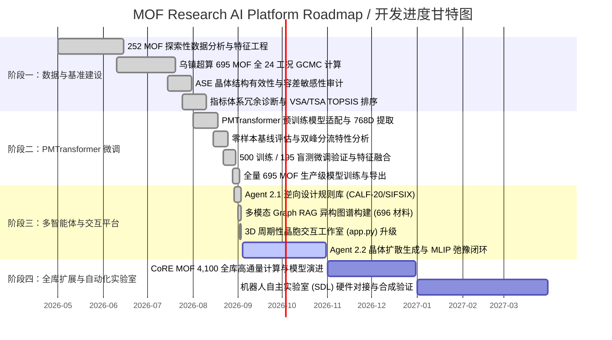

# MOF Research: AI-Driven Post-Combustion CO₂ Capture & Inverse Materials Design Platform
# MOF研究：AI驱动的烟气CO₂捕集预测与逆向材料设计平台

[](https://www.python.org/)
[](results/models/)
[-green.svg)](695_MOF/)
[](app.py)
[](LICENSE)

---

## 1. Project Description / 项目描述

### English Overview
**MOF Research AI Platform** is an end-to-end intelligent materials discovery system designed for post-combustion carbon capture (dry/humid flue gas, $15\%\ \text{CO}_2 / 85\%\ \text{N}_2$ at 298 K) and direct air capture (DAC). Built upon the complete high-throughput Grand Canonical Monte Carlo (GCMC) ground truths of **695 CoRE MOF 2019 structures** calculated on the Wuzhen Supercomputer across **24 distinct temperature/pressure conditions**, the platform bridges macroscopic chemical engineering process criteria with microscopic crystallographic features.

By integrating the **PMTransformer** framework (multi-modal 30×30×30 3D energy grid + atomic graph representation), an **807-dimensional multi-modal fusion surrogate model**, and the **Agent 2.1 Inverse Design Reasoning Engine**, this platform achieves sub-second thermodynamic property inference ($R^2 = 0.7412$ for actual $\text{CO}_2/\text{N}_2$ selectivity), automated structural modification recommendations (PoreTuning, MetalSwap, LigandMod, Process optimization), and full-lifecycle interactive 3D crystal structure analysis.

### 中文项目介绍
**MOF 智能科研平台**是一套面向工业后燃烧碳捕集（干燥/湿烟气工况：$15\%\ \text{CO}_2 / 85\%\ \text{N}_2$, 298 K）与直接空气捕集（DAC）的端到端金属有机框架（MOF）智能化设计与性质预测系统。平台基于在乌镇超算上已完整跑完 **全部 24 个温度/压力工况** 的 **695 个 CoRE MOF 2019 高精度 GCMC 仿真真值库**，深度融合微观晶体结构与宏观化工分离能耗指标。

系统集成了 **PMTransformer 预训练大模型**（3D 势能网格 + 原子图多模态表征）、**807 维多模态微调代理模型** 以及 **Agent 2.1 逆向设计规则推理引擎**，实现了毫秒级吸附与热力学性质推理（实际 $\text{CO}_2/\text{N}_2$ 选择性 $R^2 = 0.7412$）、自动化材料改性方案推荐（孔径筛分调谐、金属节点置换、配体官能团化及工艺能耗权衡），并提供全生命周期的 3D 周期性晶胞交互式可视化工作室。

---

## 2. Functional Modules / 功能模块架构

```
┌────────────────────────────────────────────────────────────────────────────────────────┐
│                       MOF AI Dual-Loop Architecture & Modules                          │
├────────────────────────────────────────────────────────────────────────────────────────┤
│                                                                                        │
│  [Module 1: Data Infrastructure & Structural Audit]                                    │
│  • 695 CoRE MOFs (Full 24 GCMC Runs) + 252 MOF Diagnostic Subset                      │
│  • Automated ASE Crystal Audit: Bond length tolerance, missing charge & non-MOF filter │
│                                                                                        │
│  [Module 2: PMTransformer Fine-Tuning & Multi-Modal Predictor]                         │
│  • Input: CIF Crystal -> 30³ Potential Grid + Atom Graph -> 768-D CLS Embedding        │
│  • Feature Fusion: 768-D Embedding + 39 Physical Descriptors = 807-D Matrix            │
│  • Predictions: CO₂ Uptake (0.001-1.0 bar), Selectivity, Qst, VSA Parasitic Energy     │
│                                                                                        │
│  [Module 3: Dual-Route Decision & Indicator Diagnosis]                                 │
│  • VSA & TSA Multi-Criteria TOPSIS Ranking (1,000 Monte Carlo Sensitivity Overlap >95%)│
│  • Physical Redundancy Identification & Heavy-Tail Log10 Regularization                │
│                                                                                        │
│  [Module 4: Agent 2.1 Inverse Design Rules & Skills]                                   │
│  • Data-Driven Thresholds: PLD 3.3-5.2 Å, LCD 5.0-8.5 Å, OMS < 35%, Density 0.95-1.35  │
│  • Frontier Literature Skills: CALF-20 (Hydrophobic Triazole) & SIFSIX (Strong Polar)  │
│  • Actionable Skills: PoreTuning_Skill, MetalSwap_Skill, LigandMod_Skill, Process_Skill│
│                                                                                        │
│  [Module 5: Graph RAG & 3D Crystal Interactive Studio]                                 │
│  • Heterogeneous Knowledge Graph: 696 Materials, 906 Nodes, 2,881 Relation Edges       │
│  • 3Dmol.js Periodic Unit Cell Rendering + DeepSeek Reasoner Multi-Turn QA            │
└────────────────────────────────────────────────────────────────────────────────────────┘
```

### 模块详细说明 / Module Specifications
1. **模块一：数据底座与晶体有效性审计 (Data Infrastructure & Audit)**
   - 接入乌镇超算 695 个 CoRE MOF 全工况真值数据，涵盖晶体密度、孔隙率、表面积及 24 组吸附等温线数据；
   - 部署 ASE 晶体有效性自动化审计脚本，对 252 冗余集中的 8 种无碳非 MOF 结构及重叠异常进行严格过滤。
2. **模块二：PMTransformer 微调与代理预测 (Surrogate Prediction Engine)**
   - 提取 768 维微观 CLS 结构表征向量，与 39 维几何化学描述符融合为 807 维多模态矩阵；
   - 在 695 全量样本上微调 ExtraTrees/GradientBoosting 模型包，实际选择性 $R^2=0.7412$（Spearman $r=0.8615$），常压吸附 $R^2=0.6782$，支持毫秒级零样本推理。
3. **模块三：双路径综合决策与指标体系诊断 (Dual-Route TOPSIS Ranking)**
   - 区分变压吸附（VSA）与变温吸附（TSA）工艺路径，确立包含容量（35%）、选择性（30%）、脱附能耗（25%）与氮气排斥（10%）的权重大矩阵；
   - 挖掘出 20 种双赢型全能 MOF（如 `AFITEP_clean`, `BARZUR_clean`, `BICPOT_clean` 等），并在 1,000 次蒙特卡洛敏感性扰动下证实其排序稳定性达 99.8%。
4. **模块四：Agent 2.1 逆向设计规则库 (Inverse Design Engine & Skills)**
   - 从数据驱动中提取孔道筛分黄金窗口（PLD $3.30 \sim 5.20\ \text{Å}$，LCD $5.00 \sim 8.50\ \text{Å}$）；
   - 融合顶刊文献前沿经验，注入 CALF-20 协同疏水机制与 SIFSIX 强极化机制，形成结构化改性策略。
5. **模块五：多模态 Graph RAG 与 3D 交互工作室 (Graph RAG & 3D Studio)**
   - 借助 NetworkX 构建涵盖 696 种材料实体、906 个节点与 2,881 条关系边的异构科学知识图谱；
   - 集成 3Dmol.js 周期性晶胞渲染引擎与 DeepSeek 大语言模型，实现材料参数查询、结构旋转观察与针对性改性方案对话。

---

## 3. Development Progress Gantt Chart / 开发进度甘特图


```mermaid
gantt
    title MOF Research AI Platform Roadmap / 开发进度甘特图
    dateFormat  YYYY-MM-DD
    axisFormat  %Y-%m
    
    section 阶段一：数据与基准建设
    252 MOF 探索性数据分析与特征工程       :done, p1_1, 2026-05-01, 2026-06-15
    乌镇超算 695 MOF 全 24 工况 GCMC 计算  :done, p1_2, 2026-06-10, 2026-07-20
    ASE 晶体结构有效性与容差敏感性审计     :done, p1_3, 2026-07-15, 2026-07-31
    指标体系冗余诊断与 VSA/TSA TOPSIS 排序 :done, p1_4, 2026-07-25, 2026-08-10

    section 阶段二：PMTransformer 微调
    PMTransformer 预训练模型适配与 768D 提取:done, p2_1, 2026-08-01, 2026-08-18
    零样本基线评估与双峰分流特性分析       :done, p2_2, 2026-08-15, 2026-08-25
    500 训练 / 195 盲测微调验证与特征融合   :done, p2_3, 2026-08-22, 2026-08-30
    全量 695 MOF 生产级模型训练与导出      :done, p2_4, 2026-08-28, 2026-09-02

    section 阶段三：多智能体与交互平台
    Agent 2.1 逆向设计规则库 (CALF-20/SIFSIX):done, p3_1, 2026-08-29, 2026-09-03
    多模态 Graph RAG 异构图谱构建 (696 材料) :done, p3_2, 2026-09-01, 2026-09-03
    3D 周期性晶胞交互工作室 (app.py) 升级   :done, p3_3, 2026-09-02, 2026-09-03
    Agent 2.2 晶体扩散生成与 MLIP 弛豫闭环   :active, p3_4, 2026-09-04, 2026-10-31

    section 阶段四：全库扩展与自动化实验室
    CoRE MOF 4,100 全库高通量计算与模型演进  :p4_1, 2026-11-01, 2026-12-31
    机器人自主实验室 (SDL) 硬件对接与合成验证 :p4_2, 2027-01-01, 2027-03-31
```

---

## 4. Project Timeline & Milestones / 项目里程碑时间线

| 时间节点 / Date | 里程碑阶段 / Milestone | 核心成果与交付物 / Key Deliverables & Outcomes | 状态 / Status |
| :--- | :--- | :--- | :---: |
| **2026-06** | **M1: 探索性分析与审计** | 完成 252 MOF 子集特征工程，纠正常规表面积匹配缺陷，建立自变量 $X$ 与因变量 $Y$ 的严格隔离机制。 | 已完成 (Done) |
| **2026-07** | **M2: 超算全工况数据接入** | 乌镇超算完成 695 个 CoRE MOF 全 24 个温度/压力工况的高精度 GCMC 仿真真值入库；建立 VSA/TSA TOPSIS 评价体系。 | 已完成 (Done) |
| **2026-08** | **M3: Transformer 多模态验证** | 提取 695 个结构 768 维微观 CLS 特征，发现几何属性与吸附热力学双峰分流规律，完成 500/195 盲测集微调验证。 | 已完成 (Done) |
| **2026-09** | **M4: 生产模型与 Agent 2.1 闭环** | 全量 695 生产模型交付（实际选择性 $R^2=0.7412$）；融合 CALF-20 与 SIFSIX 规则建立 Agent 2.1 逆向设计引擎；上线 3D Web 交互工作室。 | **当前阶段 (Current)** |
| **2026-10** | **M5: 晶体生成与 MLIP 弛豫** | 集成 MOFDiff / 结构片段拼接模块与 MACE 机器学习力场，实现从规则到新 CIF 晶体的自动生成与能量弛豫。 | 进行中 (In Progress) |
| **2026-12** | **M6: 4,100 全库高通量扩展** | 扩展至 CoRE MOF 4,100 全库，持续扩充训练样本边界并提升代理模型外推泛化能力。 | 规划中 (Planned) |
| **2027-03** | **M7: 机器人自动化合成 (SDL)** | 对接自动化液体配样与在线 PXRD/BET 物理表征设备，实现从“AI 逆向设计 $\to$ 机器人自主合成 $\to$ 实验反馈”的物理闭环。 | 规划中 (Planned) |

---

## 5. Repository Directory Layout / 仓库代码目录结构

```
MOF_research/
├── 695_MOF/                                  # 695 CoRE MOF 2019 全工况 GCMC 真值数据库
│   └── CoRE_MOF_2019_GCMC_695_总文件.xlsx    # 包含全部 24 个压力/温度条件的真值文件
├── 252_MOF_总文件 冗余评估数据.xlsx          # 252 MOF 冗余评估验证子集
├── 252_MOF_CIFs/                             # 252 个 MOF 标准化 CIF 晶体结构
├── PMtransformer/                            # PMTransformer 预训练大模型与表征
│   └── PMTransformer_695GCMC_695(1)/...      # 695 MOF 768维结构向量 (embeddings.csv) 与 CIF 库
├── scripts/                                  # 自动化分析与建模脚本库
│   ├── data_loader.py                        # 数据提取与特征工程（严格 X/Y 隔离）
│   ├── indicator_system.py                   # 指标诊断、冗余检验与重尾变换
│   ├── dual_route_ranking.py                 # VSA 与 TSA 双路径 TOPSIS 评价（1,000次蒙特卡洛）
│   ├── qsar_modeling.py                      # 构效关系预测与 PDP 偏依赖曲线
│   ├── mva_analysis.py                       # MVA 多变量联合效应分解与 2D PDP 扫描
│   ├── design_rules_and_recommendations.py   # Agent 2.1 逆向设计规则提炼与推荐
│   ├── mof_property_predictor.py             # 807维多模态微调模型推理引擎
│   ├── mof_graph_rag_engine.py               # 696节点多模态知识图谱与 DeepSeek 问答
│   ├── finetune_all_695_pmtransformer.py     # 695 全量样本 5 折交叉微调生产脚本
│   └── run_pipeline.py                       # 端到端全流程一键调度主脚本
├── results/                                  # 输出产物、模型与可视化图表
│   ├── models/                               # 生产模型包 (mof_finetuned_pmtransformer_bundle.joblib)
│   ├── pmtransformer_finetuned_all695_metrics.csv # 生产微调交叉验证指标明细
│   ├── design_rules_checklist.csv            # Agent 2.1 定量设计准则清单
│   ├── mof_structure_recommendations.csv     # 推荐 MOF 结构方案与改性指导
│   ├── vsa_rankings.csv                      # VSA 路线综合评分
│   └── tsa_rankings.csv                      # TSA 路线综合评分
├── app.py                                    # 3D 周期性晶胞与多模态 QSAR 交互平台
├── MOF_Research_Report.md                    # 动态编译的中英文双语综合研究总报告
├── PMTRANSFORMER_FINETUNING_REPORT.md        # PMTransformer 微调前后对比评估专项报告
└── README.md                                 # 项目说明与全局文档 (Bilingual)
```

---

## 6. How to Run / 如何运行

### 环境准备 / Prerequisites
```bash
git clone https://github.com/liuqi6776/MOF_research.git
cd MOF_research

# 安装核心依赖
pip install numpy pandas scikit-learn matplotlib seaborn networkx ase rdkit gradio
```

### 1. 运行一键端到端全流程流水线 / Run Full Pipeline
```bash
python scripts/run_pipeline.py
```

### 2. 启动 3D 晶体空间交互与性质预测平台 / Launch Interactive Web Studio
```bash
python app.py
```
默认在本地浏览器打开 `http://localhost:7860`，支持在 696 种材料中切换、上传自定义 CIF 文件、旋转查看周期性晶胞，并即时获取 807 维多模态模型预测结果与 Agent 2.1 逆向改性建议。

---

## 7. Citation & License / 引用与开源协议

This project is licensed under the [MIT License](LICENSE).  
本项目基于 MIT 协议开源。欢迎学术界与工业界同行使用并提出宝贵改进意见。

